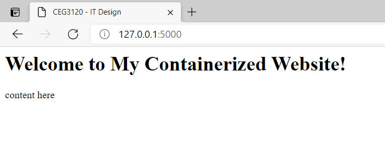

## My CEG3120 Project4

### Milestone 1: create a dockerfile / and docker container for my website. 
- Install Docker for Windows
    - WSL2
    - source to install WSL2
    [Windows Subsystem for Linux Installation](https://docs.microsoft.com/en-us/windows/wsl/install-win10#step-4---download-the-linux-kernel-update-package)
- Dockerize website and test locally
    - run `docker run -d -p 80:80 docker/getting -started`
    - `docker ps` to see running container
    - `docker kill my_container_ID` to kill running container
    - create a `html` folder inside repo, create a `index.html` inside html folder.
    - create a `Dockerfile` inside repo
        - `FROM httpd:2.4` version of appache base
        - `COPY ./html/ /usr/local/apache2/htdocs/` where from are your machine and where to on the container
    - run the command to build and run the Docker image
        - `$ docker build -t my_image-name .`
        - `docker run -d -p 5000:80 my_image_name`
    - source 
    [dockerhub](https://hub.docker.com/_/httpd)
    [Docker Cheat Sheet](https://www.docker.com/sites/default/files/d8/2019-09/docker-cheat-sheet.pdf)
- Screenshoot

